# Voting System

This is an electronic voting system designed for the user to input pre-made PPS numbers. If the correct PPS numbers are input, they will receive a message
printing their ID number and a prompt asking them who they would like to vote for. The spreadsheet will then update, showing that they voted and who they voted for.

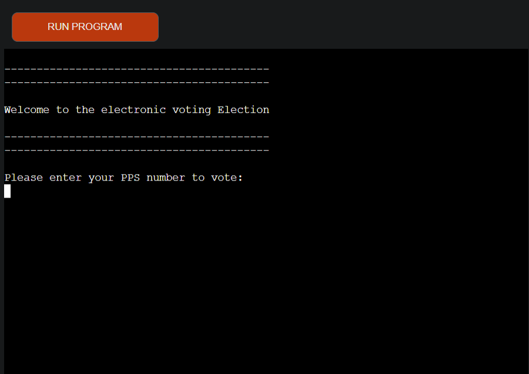

[Live Webpage](https://voting-system-project.herokuapp.com/)

(Developer: Philip O'Sullivan)

## Project Goals 
The project goal is to create an electronic voting system using Python.

### User Goals

The application user wants to try and test a voting system using python.

### Site Owner Goals

I wanted to show any user who was interested, how an electronic voting system could work. The voting system prompts the user to input a PPS number and vote on a nominee. There are 4 pre-made PPS numbers registered to vote, once all 4 people have voted the program will end displaying the results of the vote in percentages. In the case that the vote goes 2 v 2 it will inform the user the result as a draw.
The application provides a working electronic voting system.

## User Experience

### Target Audience
- Users interested in voting.
- Users interested in electronic voting and want to test it.
- Users interested in using a voting system in the future.

### User Requirements and Expectations

### User Stories
1. To show your ID with your PPS number.
2. To stand in line.
3. To enter booth with computer inside already running.
4. To be prompted to enter your PPS number.
5. To be prompted if the PPS number entered is valid or invalid.
6. To be prompted if the PPS number format is correct or incorrect.
7. To be prompted with a try again message if format or input is invalid.
8. To enter a valid and registered PPS number.
9. To be prompted with your voting ID number.
10. To be prompted with who you would like to vote for.
11. To vote for one of the two nominees.
12. To recieve a confirmation and thank you message.
13. To clear the terminal after 5 seconds before the next voter.
14. To leave the booth.
15. To have next voter enter and repeat.
16. To be prompted when the voting has closed and who won.

## Pre-made PPS Numbers on spreadsheet

1. 7914585W
2. 3659912E
3. 5686956X
4. 9954938T

## Technical Design

### Flowchart

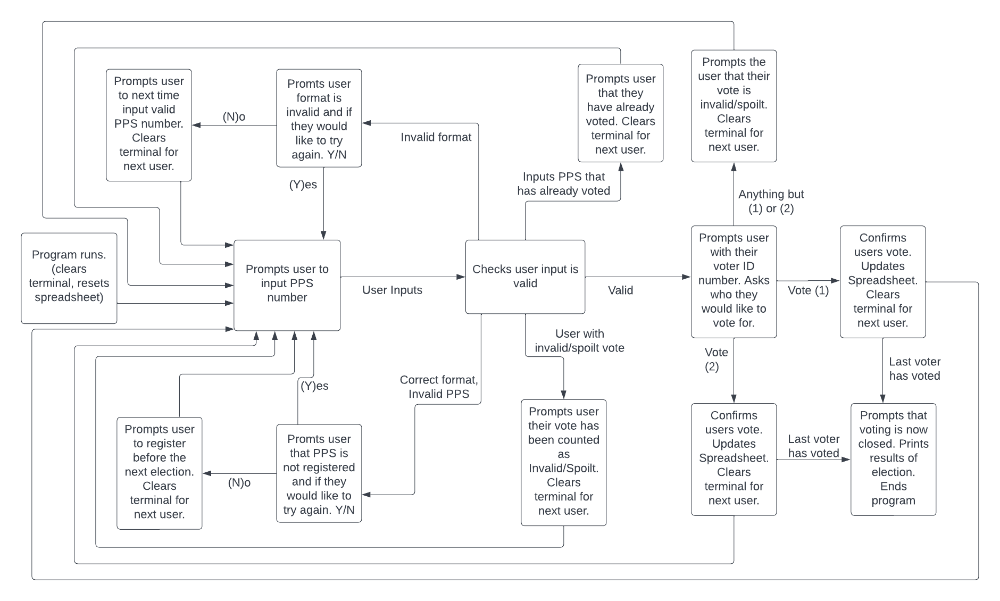

### Data Modelling
- The data stored in the Google Spreadsheet is if the voter has voted and
which nominee they have voted for.

- The user will input their PPS, the function will check if that PPS matches
a PPS on the spreadsheet. If it matches with a PPS on the spreadsheet the user will receive a message showing their voter ID and which nominee they would like to vote for. Once the user has chosen either of these nominees they will be prompted with a message confirming the vote. Then the Google Spreadsheet will be updated with this information.

### Google sheet voting system schema

- ID (integer) |
PPS (string) |
ADMIN (boolean 1 or 0) |
VOTE (boolean 1 or 0) |
NOMINEE (string)

### Note

- I acknowledge that perhaps a real-world electronic voting system would allow the user to re-try voting if they provided an invalid candidate number, however, traditional voting systems account for  spoilt votes, which I wanted to simulate here. The program already demonstrates input validation elsewhere (with the option for the user to retry where they've entered an invalid input).

## Technologies Used

### Languages
- Python 3

### Frameworks & Tools
- Heroku
- Google Drive: Used as a cloud hosting platform for the spreadsheet.
- Google Spreadsheet: Used because Python does not have a built in library to store data in an external spreadsheet.
- pycodestyle: Used as a validation tool instead of pep8 online.
- gitHub
- Gitpod
- Git
- Searched [Google](https://www.google.com/) for ideas and guidance.
- Searched [YouTube](https://www.youtube.com/) for ideas and guidance.
- [Slack](https://slack.com/intl/en-ie/)
- [Stack-Overflow](https://stackoverflow.com/)
- [w3schools](https://www.w3schools.com/)

## Features

### Welcome Message
- Welcoming the voter

### Input valid PPS from Google Spreadsheet
- Print the users voter ID number and ask them which nominee to vote for
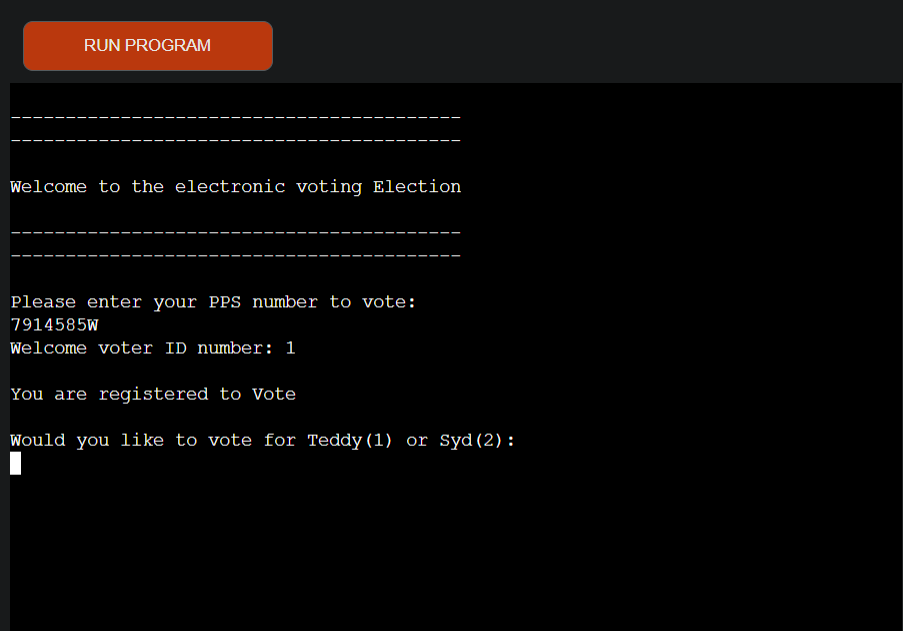

### Input valid option for nominee
- Confirm the users vote
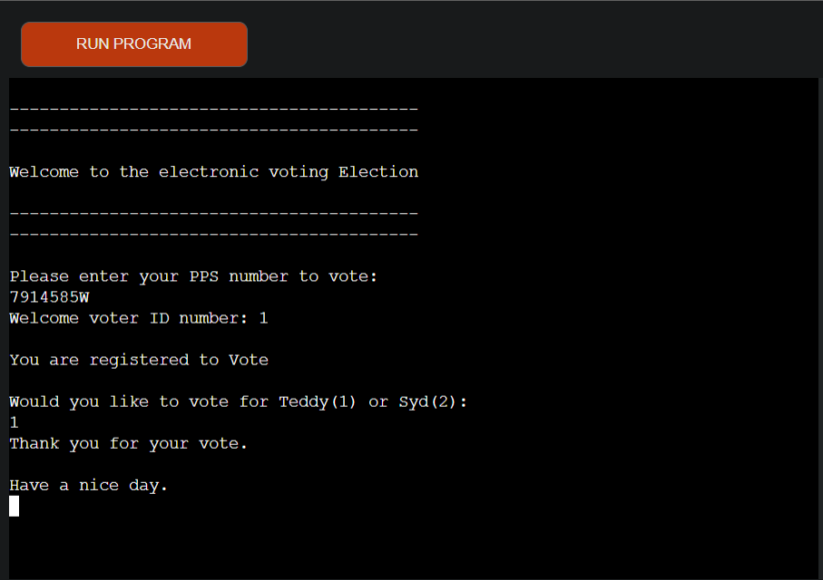

### Input an invalid option for nominee
- Inform the user that their input was invalid and their vote is spoilt
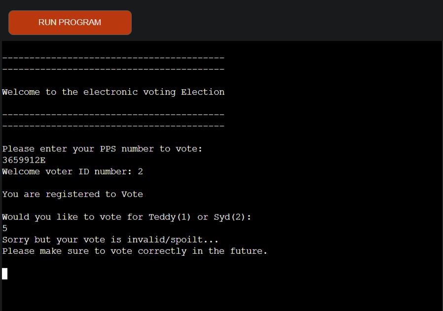

### Input a PPS that has had an invalid/Spoilt vote
- Inform the user that this PPS has already voted and the vote was counted as spoilt
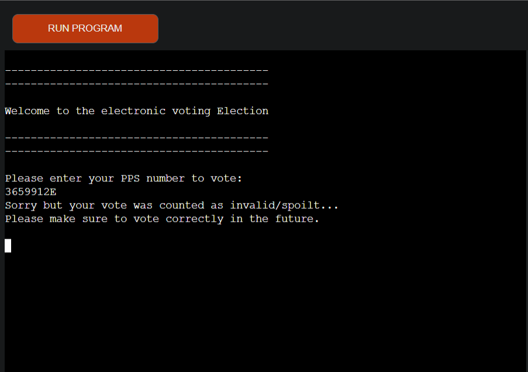

### Input a PPS number that has already voted
- Inform the user that this PPS number has already voted
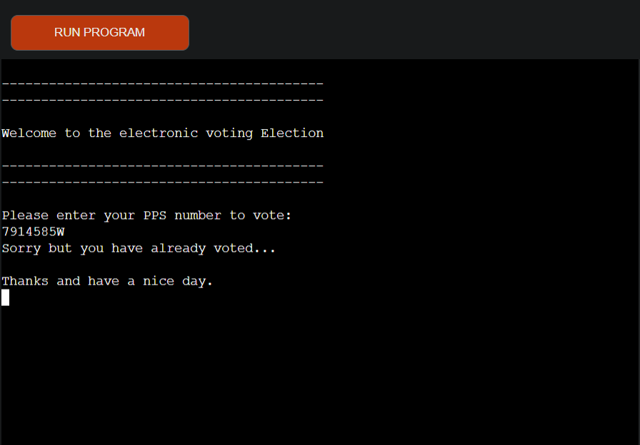

### Input a PPS in correct format that is not in the Google Spreadsheet
- Inform the user that this PPS is not registered to vote
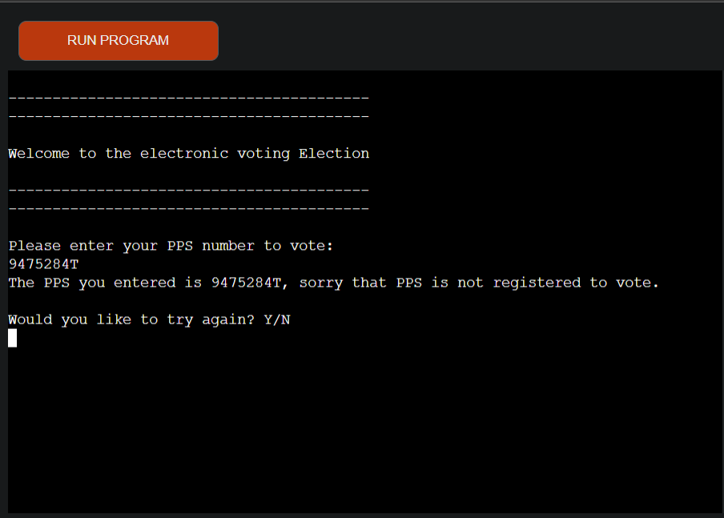

### Answer - 'Y'es
- Inform the user to double check their PPS when they retry

### Answer - 'N'o
- Let the user know to register before the next election
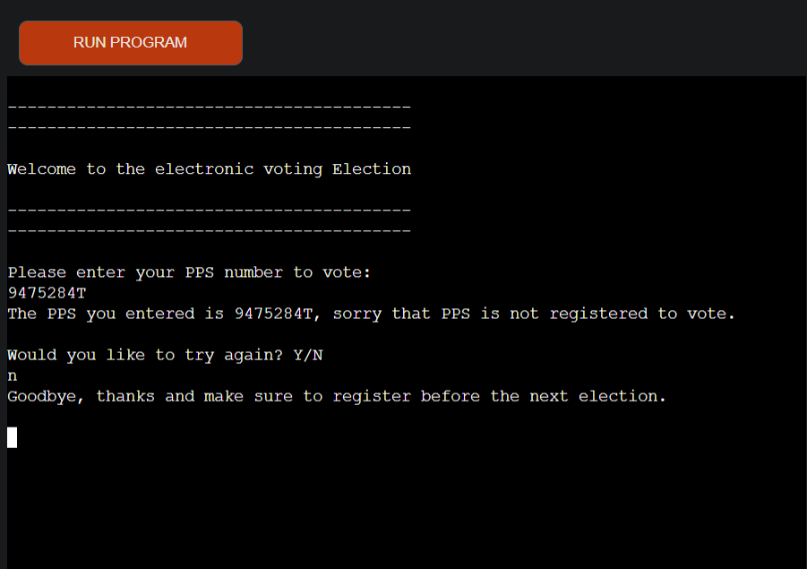

### Input a PPS in invalid format
- Let the user know the PPS the entered is in invalid format and give an example
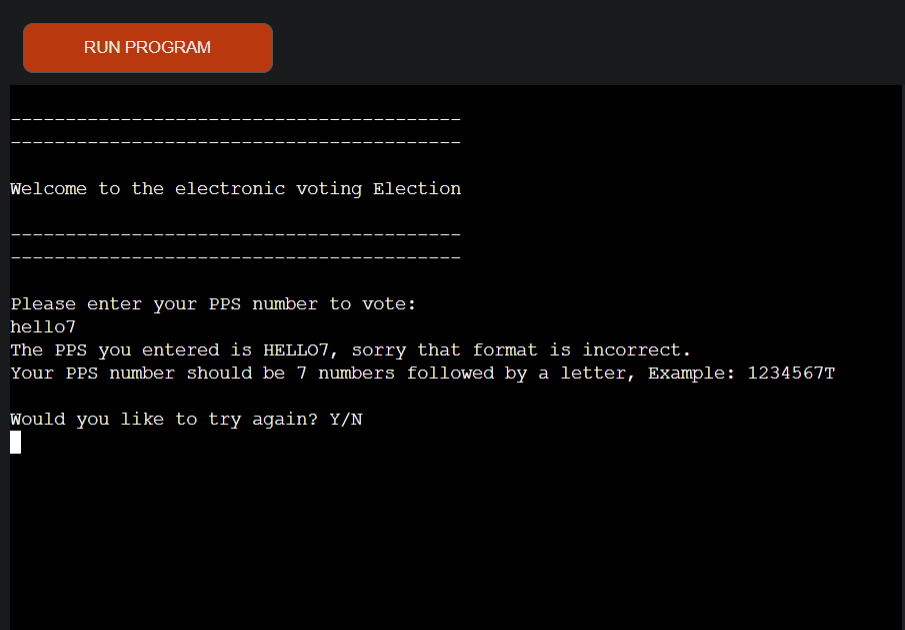

### Answer - 'Y'es
- Inform the user to make sure that the format is correct when they retry
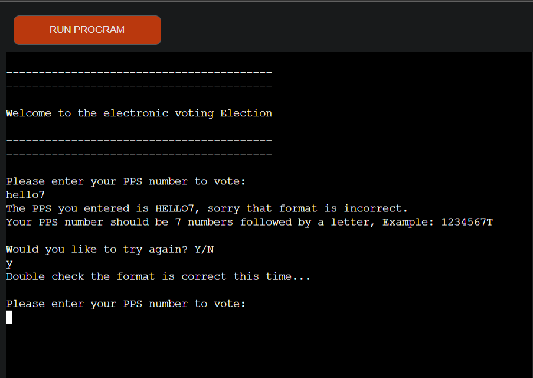

### Answer - 'N'o
- Inform the user to use a valid PPS number next time they vote
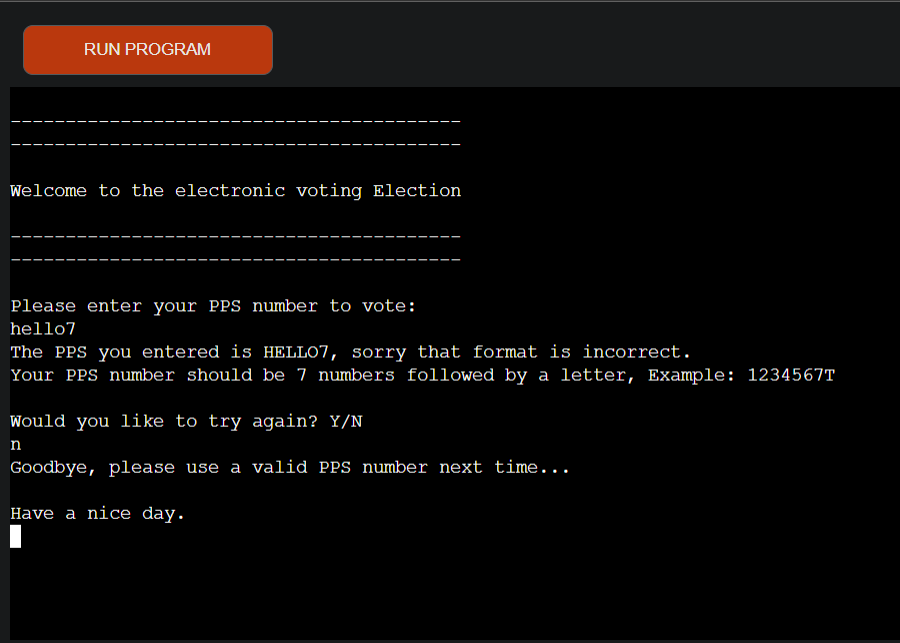

### Input anything but 'y' or 'n'
- Inform the user the input was invalid and if they would like to try again
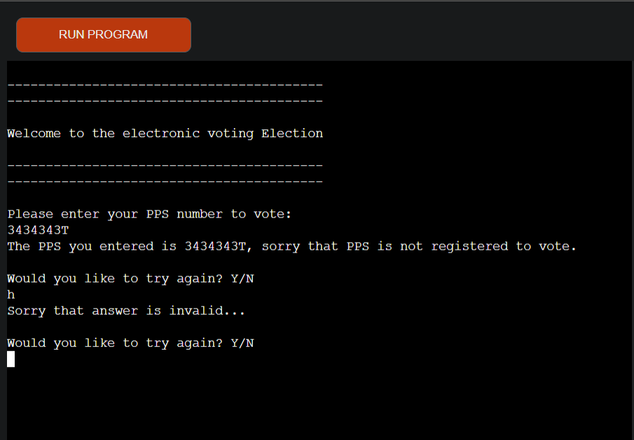

### Input all votes for a draw
- Inform all voters the voting is now closed and the result was a draw
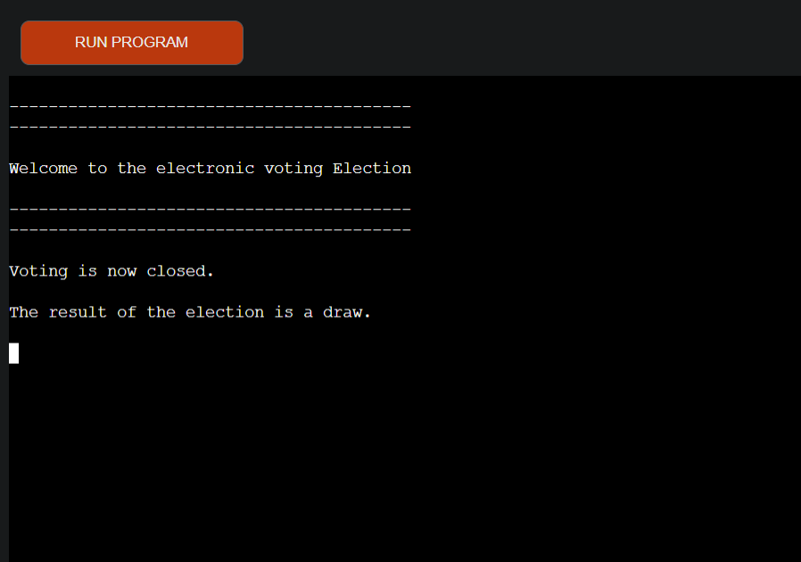

### Input all votes for a win
- Inform all voters the voting is now closed and who the winner is
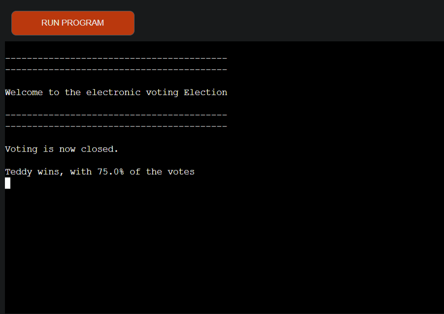

### Features to implement in the future

- I would like to add the Admin functionality. Adjust the voting system settings (example: modify the maximum amount of voters). An extra spreadsheet with Admin settings. From my voting system schema you can see that Admin is the user with 1 in the Admin column.
- I would like to add a password(login/sign up functionality), so each user would enter their PPS followed by a password to vote.

## Validation

### PEP8 validation
 To validate the code, I used a PEP8 validator that is built into the GitPod Workspace.

1. Run the command 'pip3 install pycodestyle'. (This extension may already be installed, if it is then this command will do nothing.)
2. In the workspace, press Ctrl+Shift+P (or Cmd+Shift+P on Mac).
3. Type the word 'linter' into the search bar that appears. 
4. Click on 'Python: Select Linter' from the filtered results.
5. Select 'pycodestyle' from the list.
6. PEP8 errors will now be underlined in red, as well as being listed in the PROBLEMS tab beside the terminal.

- I also used https://pep8ci.herokuapp.com/

Results:

All clear, no errors found

### Testing user stories

1. To Enter a valid PPS number from Google Spreadsheet.

| **Feature** | **Action** | **Expected Result** | **Actual Result** |
|-------------|------------|---------------------|-------------------|
| Input | Input a valid PPS number | Accepts PPS number and allows the user to cast their vote | PASSED |

2. To input a valid option for nominee.

| **Feature** | **Action** | **Expected Result** | **Actual Result** |
|-------------|------------|---------------------|-------------------|
| Input | Input (1) or (2) depending on the nominee to vote for | Confirms the vote and updates it to the Spreadsheet | PASSED |

3. To input an invalid option for nominee.

| **Feature** | **Action** | **Expected Result** | **Actual Result** |
|-------------|------------|---------------------|-------------------|
| Input | Input anything besides 1 or 2 | User is prompted with a message saying the vote is invalid/spoilt | PASSED |

4. Input a PPS that has had an invalid/Spoilt vote

| **Feature** | **Action** | **Expected Result** | **Actual Result** |
|-------------|------------|---------------------|-------------------|
| Input & Spoilt | Input a PPS number that already has an invalid/spoilt vote | User is prompted with a message that this PPS numbers vote has already been counted as invalid/spoilt | PASSED |

5. Input a PPS number that has already voted

| **Feature** | **Action** | **Expected Result** | **Actual Result** |
|-------------|------------|---------------------|-------------------|
| Input | Input a PPS number that already has already voted | User is prompted with a message that this PPS numbers has already voted | PASSED |

6. Input a PPS number in correct format but not on the Google Spreadsheet

| **Feature** | **Action** | **Expected Result** | **Actual Result** |
|-------------|------------|---------------------|-------------------|
| Input & Try again | Input an invalid PPS number in the correct format | Checks spreadsheet for PPS number and prompts that it is not registered and if they would like to try again | PASSED |

7. Input a PPS in invalid format

| **Feature** | **Action** | **Expected Result** | **Actual Result** |
|-------------|------------|---------------------|-------------------|
| Input & Try again | Input an invalid PPS number in incorrect format |User is prompted that it is not in correct format and if they would like to try again | PASSED |

8. Input an invalid option for the try again option

| **Feature** | **Action** | **Expected Result** | **Actual Result** |
|-------------|------------|---------------------|-------------------|
| Input & Try again | Input anything but 'y' or 'n' | User is prompted with a message that their input was invalid and if they would like to try again | PASSED |

9. To vote with all 4 voters registered.

| **Feature** | **Action** | **Expected Result** | **Actual Result** |
|-------------|------------|---------------------|-------------------|
| End result | Input all 4 votes using all valid 4 PPS numbers | Ends the voting and prompts the user with the correct result | PASSED |

## Bugs

| **Bug** | **Fix** |
| ----------- | ----------- |
| Terminal cleared too fast after each user had voted preventing them from seeing the confirmation message | Imported and used the sleep function with a 5 second timer |
| Welcome message wouldn't display for new voter | Create welcome message function |

## Deployment

- Deploy to Heroku following these steps:

1. Use the "pip freeze -> requiremnts.txt" command in the gitPod terminal; to save any libraries that need to be installed to the project files in Heroku.
2. Login or create a Heroku account.
3. Click the "New" button in the upper right corner and select "Create New App".
4. Choose an app name and your region and click "Create App". Note: the app name must be unique.
5. Go to the "Settings" tab, add the python build pack and then the node.js build pack. This is to ensure the project functions correctly with the Code Institute pre-installed template.
6. Create a "Config VAR" with the 'CREDS' key and the enter the value of the creds.json file.
7. Create a second "Config VAR" with the key of 'PORT' and value of '8000'
8. Go to the "Deploy" tab and pick GitHub as a deployment method.
9. Search for a repository to connect to.
10. Click enable automatic deploys and then deploy branch.
11. Wait for the app to build and then click on the "View" link.

## Cloning

- Clone a project following these steps:

1. Open GitHub.
2. Click on the project to be cloned.
3. You will be provided with three options to choose from, HTTPS, SSH or GitHub CLI, click the clipboard icon in order to copy the URL.
4. Open a new terminal.
5. Change the current working directory to the location that you want the cloned directory.
6. Type 'git clone' and paste the URL copied in step 3.
7. Press 'Enter' and the project is cloned.

## Forking

- Fork a project following these steps:

1. Open GitHub.
2. Click on the project to be forked.
3. Click on Fork button in the upper right hand corner.
4. Clone the fork of your repo, so you can edit the contents locally.
5. Make edits to your local cloned copy of the repo on your computer.
6. `git` `add`, `commit` and `push` those edits back to your fork on GitHub.
7. Suggest the changes that you made, to be added to Project repo using a pull request.

## Credits

### Code

- Code Institute Love Sandwiches project
- Code institute Python lessons
- Stackoverflow https://stackoverflow.com/questions/16675258/python-gspread-how-can-i-update-multiple-cells-with-different-values-at-once
- Google
- YouTube https://www.youtube.com/watch?v=KqyZc6uR9QU

## Extra note
- I had an issue with the first repository, so I created a new repository when my mentor reccomended it.

## Acknowledgements

I would like to take the opportunity to thank:

- My mentor Brian Macharia

- A passed student Feddie Dermesonoglou

- To all the lovely people from Code Institute and on Slack 